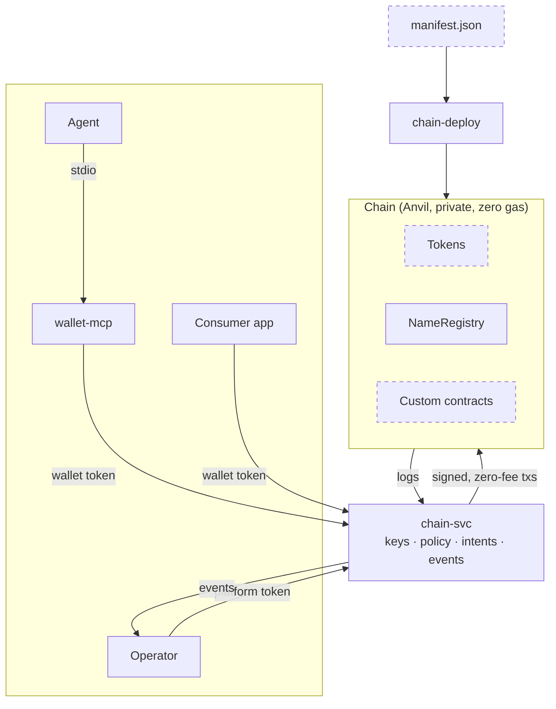
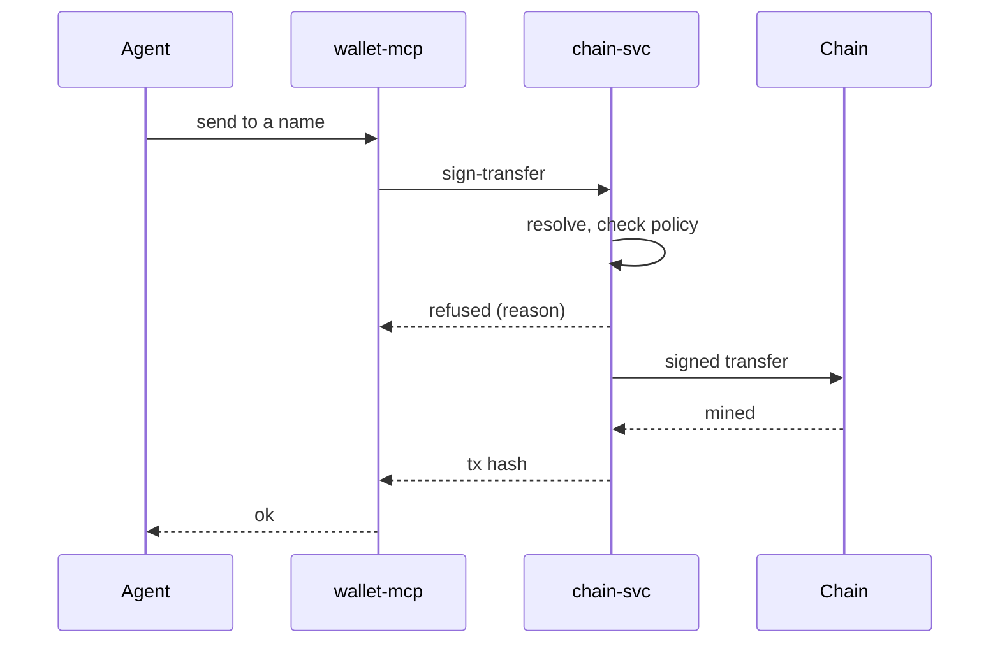

# agent-chain

A private EVM chain for agents: stand it up wherever a project needs money,
names or contracts for agents to test against, inside a private environment
with nothing reaching a public network. One `docker compose` profile brings up:

- **`chain`** — a single-node [Anvil](https://github.com/foundry-rs/foundry) node
  (chain id 31337), loopback only, zero gas, state persisted to a volume.
- **`chain-deploy`** — a one-shot Foundry script that deploys the contracts and
  writes their addresses to `deployments/local.json`.
- **`chain-svc`** — the only process that holds keys. It custodies one key per
  wallet plus the treasury, applies policy (per-wallet caps, allow/deny lists,
  freezes, idempotent intents), signs and sends, and publishes every transfer,
  name change and anomaly to an event sink over HTTP. Everything else talks to
  the chain through it.
- **`wallet-mcp`** — a small stdio [MCP](https://modelcontextprotocol.io) server
  an agent runs to hold and spend by *name*, never by address. It keeps no key
  and maps every refusal onto a short, closed set of reasons an agent may see.
  It is one client of `chain-svc`'s HTTP API, not the only one.

**The API is `chain-svc`'s HTTP interface.** Anything that holds a wallet token
can use it — an agent through `wallet-mcp`, or any application or service
directly: spawn is the operator's, but balance, history, name lookup and sending
by name are the same calls for every wallet holder. The platform token is the
operator's: mint, fund, spawn, freeze, rotate, set a balance, read anything.

## How the pieces fit

Dashed boxes land with the next release; everything else is on `main` today.



A **manifest** names what a deployment has: token instances (name, symbol,
initial supply), an optional name registry (with the suffix names end in), and
further modules. `chain-svc` reads the result at boot and serves only what is
deployed: money endpoints exist when a token does, name endpoints when the
registry does, and `wallet-mcp` advertises only the tools that work. Today the
tree carries one sample ERC-20 (`VEEBux`) and the registry; the generic `Token`
named at deploy, the manifest, and module-gated endpoints are landing next, then
a generic, allowlisted contract-call operation, and a `Converter` module that
exchanges one token for another at operator-set rates.

## A payment, end to end



1. The agent calls `send` on wallet-mcp: a **name** to pay, an amount, and an
   intent id it chose.
2. wallet-mcp posts `/sign-transfer` to chain-svc with its wallet token.
3. chain-svc resolves the name to an address, checks the wallet's policy
   (frozen? over its cap? this intent id already used?) and refuses with one of
   a closed set of reasons if anything fails — the agent sees the reason, never
   the address or the internals.
4. Otherwise chain-svc signs `transferWithIntent` with the agent's own key at
   zero fee and sends it; the chain mines it and emits the transfer logs.
5. wallet-mcp returns the tx hash to the agent; chain-svc posts the transfer as
   an event to the operator's sink.

The intent id is the idempotency key on the service side: chain-svc refuses a
second send under the same id, and the operator can check any claimed payment
in one call. The contract records the id in its event and deliberately does not
deduplicate, so a second emission under one id (from anywhere) is visible as an
anomaly rather than suppressed.

## Layout

```
contracts/          Foundry project: src/, script/Deploy.s.sol, test/, mutation/
deployments/        local.json for THIS deployment (gitignored)
docker/             the Anvil image and verification scripts
svc/                chain-svc (bun, HTTP on 127.0.0.1:7000)
wallet-mcp/         the MCP server (bun, stdio)
compose.chain.yml   the `chain` profile
```

## Running it

```
git submodule update --init --recursive   # Foundry vendors forge-std and OpenZeppelin
bun install
docker compose -f compose.chain.yml --profile chain up
```

Compose reads three secrets from a `.env` in this directory (or from the
environment): `ANVIL_MNEMONIC` (a BIP-39 phrase), `CHAIN_SVC_TOKEN` (the
operator's platform token) and `KEYSTORE_SECRET` (encrypts wallet keys at rest).
Generate them; never commit them.

`contracts/` needs Foundry v1.8.1 (`forge test`); `svc/` and `wallet-mcp/` need
only bun. `svc/src/abi.ts` is generated from the contract build and committed —
CI regenerates it and fails on a diff, so a contract change that is not reflected
in the service cannot merge.

## Consuming it

A harness takes this repo as a git submodule pinned to a tag, mounted at
`chain/`; every path on that side — the Dockerfile `COPY`, `compose -f
chain/compose.chain.yml`, the workspace members — works unchanged. Tags are the
interface. A consumer at a different directory depth than this repo is the only
build that can catch a wrong `COPY` (see `.dockerignore` for the case that
taught us), so a release is not done until a consumer has built it.

## Trust model, in one paragraph

Keys never leave `chain-svc`. Agents authenticate to it with a per-wallet token
and can act only on their own wallet, within caps the operator sets; the
operator's platform token can mint, fund, spawn, freeze and read anything, and is
held by nothing an agent can reach. The RPC is bound to loopback because it is
unauthenticated. The chain is play money by construction: private, zero-fee, and
refusing to start against anything that is not a private chain.

## Status

Pre-release. The sequence of work is: repo split (done) → modules and manifest →
generic call op → second token and converter.
